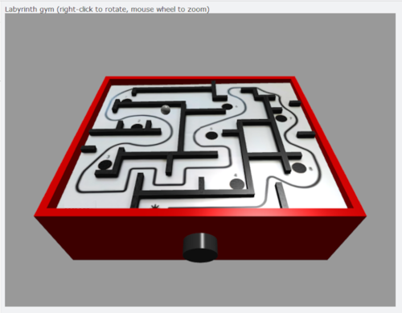
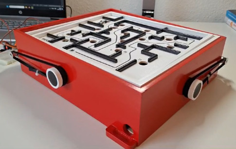

# Playing the BRIO Labyrinth with Reinforcement Learning

> [!IMPORTANT]
> This respository is __work-in-progress__ of student theses. 
> It is subject to change, __not__ a reviewed publication of final results.

## What's it about?

I like to play. And since you visit this repository, most probably so do you!

Apart from this, I am also educating future engineers at Hamburg University of Applied Sciences (HAW Hamburg). As lecturer I try to offer my students projects where they can apply and integrate different fields of technology. In the best case these activities are motivating and fun, let students develop relevant competencies for their profession, and result in attractive demonstrators for other students and the general public.

In this context we started working on several different self-learning systems controlled by Artificial Intelligence (AI), or more concrete applied __Deep Reinforcement Learning__ (DRL). These activities are still comparably new and we haven't completed a fully-functional system, yet. However, we have made some good progress that we are willing to share with you.

## Overview
In one of our systems we apply Deep Reinforcement Learning to navigate balls through the famous __BRIO Labyrinth game__. We approach this task by a software simulation of the labyrinth as well as by motorizing the actual physical game:

- _Virtual environment:_ The software simulation allows to develop AI models with moderate effort and time. Moreover, people can experiment with Deep Reinforcement Learning without building an automated physical device.
- _Physical environment:_ The automated hardware shall serve to demonstrate AI models and/or the training process. Isn't it much more impressive to see a physical game playing, instead of a computer animation? Apart from this, it adds engineering tasks such as image processing, electronics, 3D-prints, and others.

## Achievements so far
In a first Master thesis, Sandra Lassahn has made a very good first step into the topic and has build a solid foundation for future work. Here are some highlights:

- Virtual environment (with 3D rendering and several labyrinth layouts)
- AI agents successfully solving several labyrinth layouts
- Morotized physical labyrinth (controlled by Arduino and Python app on connected laptop)
- Solved first simple task on physical device 

## Next steps
Now that we made a first step into the topic, there are 1,000 ideas of what to improve, how to improve, and continue to develop. Let's not go into all these details here. Instead, as next major leap we want to fully automate the physical device to solve some more tasks. One key technologies to apply will be image processing needed to capture the system's state (e.g., location of the ball).

## Uploaded material
- [X] Reports ([Master thesis](docs/reports))
- [X] Virtual environment ([source code](src/environments/virtual))
- [X] Physical device ([3D print files](hardware), [source codes](src/environments/physical))
- [X] Reinforcement learning using DQN agent ([source code](src/agents), [models](src/models))
- [X] Main application to train and demonstrate agents ([source code](src/main))

## Contributors
The activities done so far and hopefully still to come are collaborations of myself and my magnificent students of our [Department at HAW Hamburg](https://www.haw-hamburg.de/hochschule/technik-und-informatik/departments/informations-und-elektrotechnik/studium/studiengaenge/):

- Marc Hensel (software, review & refactoring, 3D-prints)
- Sandra Lassahn (theses: virtual environment, functional AI models, motorized labyrinth)

## Supporters
My warm thanks go to [Allied Vision Technologies GmbH](https://www.alliedvision.com/) for provding industrial cameras, and to [Kowa Optimed Deutschland GmbH](https://www.kowa-lenses.com/) for providing camera lenses. Your valuable support and high-quality components helpe us to take the next steps into a fully-automated physical device.

## Contact
Marc Hensel, University of Applied Sciences Hamburg (HAW Hamburg)

http://www.haw-hamburg.de/marc-hensel
